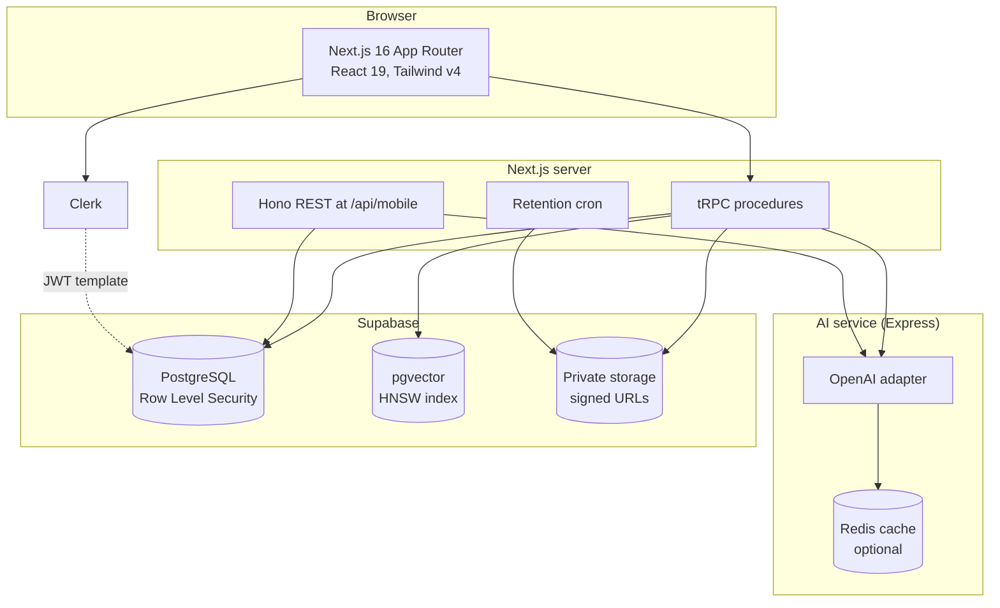
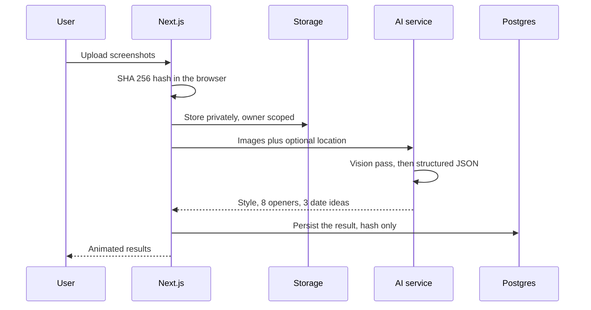

<div align="center">

# Crushie

### An AI dating coach for students

Upload a profile screenshot. Get a read on how that person communicates, openers
worth sending, and date ideas that fit both of you.

[](https://github.com/BaoT1301/Crushie/actions/workflows/ci.yml)
[](https://github.com/BaoT1301/Crushie/commits/main)
[](https://github.com/BaoT1301/Crushie)
[](https://github.com/BaoT1301/Crushie)

[](https://nextjs.org/)
[](https://www.typescriptlang.org/)
[](https://openai.com/)
[](https://supabase.com/)
[](https://trpc.io/)
[](https://clerk.com/)

</div>

## What it does

Most advice about dating apps is generic. Crushie looks at the actual profile in
front of you and works from that.

Three things happen in one pass. A vision model reads the screenshots and infers
how the person presents themselves. A language model turns that into openers you
could plausibly send. Location and weather, when available, shape date ideas that
suit the day rather than a template.

Everything else in the product exists to support that: a vibe profile that
describes you, similarity search that finds people you would get along with, and
a coach that watches a live camera feed and suggests what to say next.

## Architecture



The AI service is separate on purpose. It holds the OpenAI key, and every
endpoint on it spends money, so it sits behind a shared secret and never faces
the browser.

Clerk issues a JWT that Postgres reads through `public.user_id()`. The
application connects as a role without `BYPASSRLS`, so every policy in the schema
actually applies rather than being decorative.

## How an analysis runs



The database keeps the hash and the generated text. It has no column for the
image or its URL. The files themselves live in private storage, reachable only
through short lived signed URLs, and a scheduled job deletes them once their
retention window passes.

## Features

**Profile analyzer.** Reads up to ten screenshots at once and returns a
communication style, eight openers, and three date ideas with real venues when a
Google key is configured.

**Vibe profiles.** Onboarding builds a description of you from photos and a short
quiz, then embeds it so similarity search can find people you would get along
with.

**Discover.** Ranks candidates by semantic similarity and explains why each match
makes sense. Every candidate is shown; the model orders them but does not decide
who exists.

**Live coach.** A glasses simulator watches the camera and suggests what to say
next, with optional speech. Runs on the cheap model because it fires
continuously.

**Missions.** Paired challenges for two matched people, with check in, proof, and
points. Completion requires both participants, verified against the match rather
than inferred.

**Sample profiles.** Eight seeded personas so Discover is populated on day one.
They reply in character using the model, and they are labelled as samples
everywhere they appear. Ask one whether it is real and it will tell you.

## Stack

| Layer | Choice | Why |
|:--|:--|:--|
| Framework | Next.js 16, React 19 | App Router, server components, Turbopack |
| API | tRPC 11 plus Hono | Typed calls for the web, REST for a future mobile client |
| Database | Supabase Postgres | Row Level Security enforced, not decorative |
| Vectors | pgvector with HNSW | High recall by default, no probe tuning |
| Auth | Clerk | JWT template drives the database policies |
| AI | OpenAI gpt 4o and gpt 4o mini | Vision, structured output, embeddings |
| Styling | Tailwind v4 | Theme tokens through `@theme inline` |
| Motion | Framer Motion | Reduced motion respected globally |
| Testing | Playwright, Vitest | 35 end to end, 14 unit |

## Quick start

```bash
npm install

cp apps/web-client/.env.example apps/web-client/.env
cp apps/llm/.env.example        apps/llm/.env
# fill in Clerk, Supabase and OpenAI

npx supabase db push
npm run db:preflight            # 9 checks, all must pass

npm run dev:llm                 # AI service on 3001
npm run dev:web                 # app on 3000
```

<details>
<summary><b>Environment variables</b></summary>

Both apps ship a fully commented `.env.example`. Copy those rather than working
from this summary.

**Required**

| Variable | Notes |
|:--|:--|
| `NEXT_PUBLIC_CLERK_PUBLISHABLE_KEY`, `CLERK_SECRET_KEY` | Also create a JWT template named exactly `supabase` |
| `DATABASE_URL` | Must use the `crushie_app` role from migration 00009, never `postgres` |
| `NEXT_PUBLIC_SUPABASE_URL`, `NEXT_PUBLIC_SUPABASE_ANON_KEY`, `SUPABASE_SERVICE_ROLE_KEY` | |
| `OPENAI_API_KEY` | On the AI service |
| `LLM_SERVICE_TOKEN` | Shared secret. Identical value in both apps |
| `NODE_ENV=production` | On the AI service. Left at development it accepts unauthenticated requests |

**Optional, each degrades gracefully**

| Variable | Without it |
|:--|:--|
| `GOOGLE_MAPS_API_KEY` | Date ideas generate without real venues |
| `OPENWEATHER_API_KEY` | Weather is omitted from planning |
| `ELEVENLABS_API_KEY` | The live coach stays silent |
| `RESEND_API_KEY`, `CLERK_WEBHOOK_SECRET` | No password change email |
| `REDIS_URL` | Caching disabled, so repeat calls cost full price |
| `CRON_SECRET` | Retention returns 503 and nothing is ever deleted |

The Clerk JWT template is the single most common reason this app looks broken for
no reason. Without it every authenticated procedure throws `UNAUTHORIZED` even
though the keys are valid.

</details>

<details>
<summary><b>Scripts</b></summary>

```bash
npm run dev:web                 # app
npm run dev:llm                 # AI service

npm run typecheck               # tsc across the web app
npm run lint                    # eslint
npm test                        # unit tests, both workspaces
npm run test:e2e                # Playwright, needs a server on 3000

npx supabase db push            # apply supabase/migrations
npm run db:preflight            # 9 checks against a real database
npm run db:backfill-embeddings --workspace=@starter/web
```

`npm run db:push` and `db:migrate` are deliberately blocked. Both would apply the
schema generated by Drizzle, which models none of this project's RLS policies,
SQL functions or pgvector indexes, and applying it would drop all of them.

</details>

<details>
<summary><b>Project structure</b></summary>

```
apps/
  web-client/           Next.js app, tRPC, Hono REST surface
    src/app/            routes
    src/components/     UI, including the landing page and analyzer
    src/services/       domain logic, one folder per area
    src/server/         tRPC init, Hono app, request context
    src/db/             client, RLS scoped client, preflight
  llm/                  Express service that talks to OpenAI

supabase/
  migrations/           15 files, the single source of truth
  launch/               one time scripts to run before opening signups

e2e/                    Playwright suites
```

</details>

## Quality gates

Every gate below runs in CI on push and pull request.

| Gate | State |
|:--|:--|
| Production build | passing |
| Typecheck, both apps | clean |
| ESLint | 0 errors |
| Unit tests | 14 passing |
| Playwright | 35 passing |
| Production dependency audit | 0 vulnerabilities |
| Database preflight | 9 of 9 |

`db:preflight` is worth running after any schema or infrastructure change. Each
of its nine checks exists because the matching failure is silent: a role that
bypasses RLS, an unapplied migration, profiles with no embedding, a public
storage bucket, or a vector index quietly returning a fraction of its matches.

## Deploying

See [DEPLOYMENT.md](DEPLOYMENT.md) for the full runbook, including the variables
with no safe default, migration order, the embeddings backfill, the retention
cron, and a checklist to work through before opening signups.

Short version: put both services on one host so the AI service never needs a
public URL, rotate the database password, and confirm `NODE_ENV=production` on
the AI service before anything else.

## Privacy

The analyzer stores a SHA 256 hash of what you upload and the text the model
generated. There is no column for the image or its URL.

The uploaded files do persist in Supabase Storage, privately, scoped to the
uploader, and served only through expiring signed URLs. A scheduled job deletes
them after 30 days by default. Saying this precisely matters more than saying it
strongly: the claim is true of the database and would be false of the bucket.

## Team

Built at PatriotHacks 2026.

| | |
|:--|:--|
| Bao Tran | https://github.com/BaoT1301 |
| Lam Anh Truong | https://github.com/anhlamtruong |
| Mai Tran | https://github.com/tranthanhmai2006 |
| Nguyen Ho | https://github.com/hodangkhoinguyen |

## License

Proprietary. All rights reserved.
